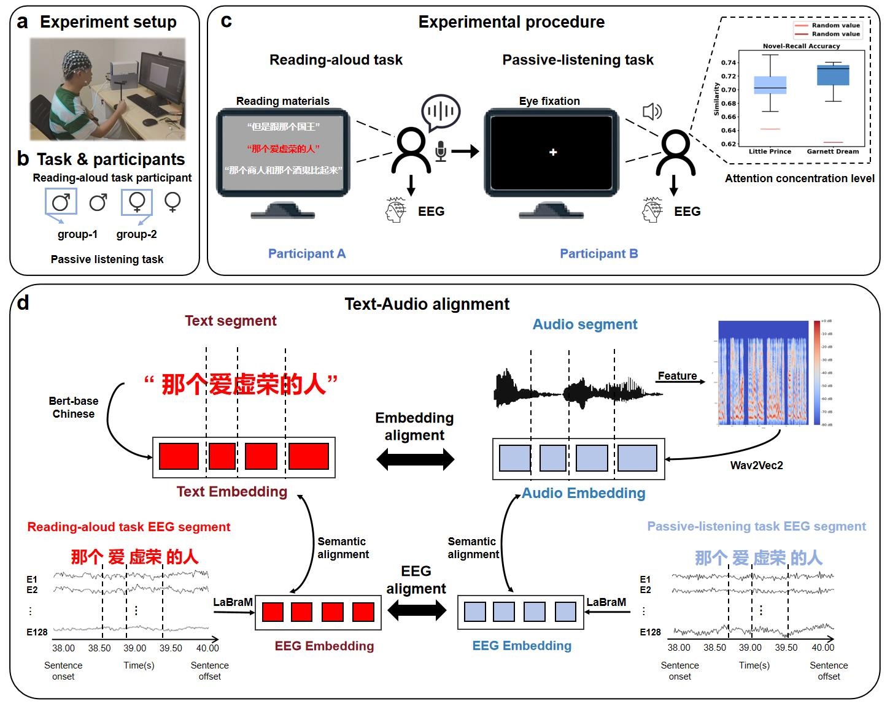

# ChineseEEG-2:An EEG Dataset for Multimodal Semantic Alignment and Neural Decoding during Reading and Listening

## Introduction

Now-existing Electroencephalography (EEG) datasets are mainly based on English, which encounters difficulty when representing Chinese. While there have been EEG datasets related to linguistic stimuli, the existing resources are limited, and many faces the problem of teacher-forcing.
In our future studies, we plan to promote a unified encoder of multi-modalities for semantic decoding, which suggests the need of more data support.
To bridge this gap, we introduce ChineseEEG-2, a high-density EEG dataset that extends ChineseEEG containing both reading aloud and auditory listening tasks. As a unique multimodal EEG dataset featuring synchronized reading and listening tasks based on the same corpus, ChineseEEG-2 dataset enables the exploration of how the brain processes language across both visual and auditory modalities in the context of Chinese natural language. It offers valuable insights into multimodal semantic alignment, neural decoding, and the alignment between large language models and neural processes, contributing to the development of BCI systems for language decoding

A total of 12 healthy participants were recruited for the study, ranging in age from 18 to 25 years (mean age: 21.9 years; 4 males, 8 females). Among the 12 participants, four (2 males and 2 females) conducted the reading task, while the rest eight conducted the passive listening task. In the formal experiment, in total, 10.8 hours of reading data (around 3 hours per subject) and approximately 21.6 hours of listening data (around 3 hours per subject) were collected, amounting to 32.4 hours of data overall.

This repository contains all the code to reproduce the experiment and data processing procedure in our paper. It aims to provide a comprehensive paradigm for the establishment of an EEG dataset based on Chinese linguistic corpora. It seeks to facilitate the advancement of technologies related to EEG-based semantic decoding and brain-computer interfaces.

The code repository contains three main modules, including scripts to reproduce the experiment, data processing, and data embedding procedures. The script `cut_chinese_novel` in the `novel_segmentation` folder contains the code to prepare the stimulation materials from source materials. The script `ui_experiment.py` contains code for the reading experiment and the `recording.py` enables trigger sending in the experiment. The script `experiment_listen.py` contains code for the listening experiment. The script `preprocessing.py` in `data_preprocessing` folder contains the main part of the code to apply pre-processing on EEG data and conversion to BIDS format. The script `text_embed.py` in the `text_and_audio_embeddings`  folder contains code to generate embeddings for semantic materials while the script `audio_embed.py` is for generating audio embeddings. The code for EEG data pre-processing is highly configurable, permitting flexible adjustments of various pre-processing parameters, such as data segmentation range, downsampling rate, filtering range, and choice of ICA algorithm, thereby ensuring convenience and efficiency. Researchers can modify and optimize this code according to their specific requirements.

## Pipeline

Our EEG recording and pre-processing pipeline is as follows:



## Device

### EEG Recording: EGI Geodesic EEG 400 series

During the experiment, The EEG (electroencephalography) data were collected by a `128-channel` EEG system with Geodesic Sensor Net (EGI Inc., Eugene, OR, USA, [Geodesic EEG System 400 series (egi.com)](https://www.egi.com/clinical-division/clinical-division-clinical-products/ges-400-series)). The montage system of this device is `GSN-HydroCel-128`. We recorded the data at a sampling rate of 250 Hz in Reading-aloud tasks and 1000 HZ in Passive-reading tasks.

The 128-channel EEG system with Geodesic Sensor Net (GSN) by EGI is a sophisticated brain activity recording tool designed for high-resolution neuroscientific research. This system features an array of evenly spaced sensors providing complete scalp coverage, ensuring detailed spatial data collection without the need for interpolation. Coupled with the advanced Net Amps 400 amplifiers and intuitive Net Station 5 software, it delivers low noise, high sensitivity EEG data acquisition, and powerful data analysis capabilities, making it an ideal choice for dynamic and expanding research environments.

## Experiment

Participants were seated in an adjustable chair positioned in front of a screen displaying the text. The chair was designed for comfort and support during the extended experimental sessions, with adjustments made to maintain each participant's viewing distance at approximately 67 cm from the screen to simulate typical reading conditions and reduce eye strain. The monitor used measured 54 cm in width and 30.375 cm in height, with a resolution of 1920 × 1080 pixels and a vertical refresh rate of 60 Hz—consistent with the experimental settings in the original dataset [ChineseEEG](https://doi.org/10.57760/sciencedb.CHNNeuro.00007).

## Usage

To prepare experimental materials, conduct the experiment, and analyze the data, follow the steps below to execute the code.

### Environment Settings

Firstly, please ensure that your code running environment is properly set up, the required packages and their corresponding version information can be found in the [requirement.txt](https://github.com/ncclab-sustech/ListeningEEG/blob/main/requirements.txt) file located in the project's root directory.

### Experiment Materials Preparation

First, to prepare the textual reading materials needed for the Reading-aloud task in the experiment, you need to convert your materials into the specific format below:

```
Chinese_novel.txt
Ch0
This is the preface of the novel
Ch1
Chapter 1 of the novel
Ch2
Chapter 2 of the novel
...
...
...
```

then run the `cut_Chinese_novel.py` script located in the `novel_segmentation` folder to perform sentence segmentation of the novel text.

We have uploaded the text materials we use in our experiment to the `materials&embeddings` part in out dataset, in which the folder `original_novel` contains the Chinese versions of the novels used in our experiment **The Little Prince** and **Garnett Dream**.

To perform Passive-listening task in this experiment, you need to collect the audio read by the participants in the Reading-aloud task.

### Experiment

After material preparation, the script `ui_experiment.py` and `recording.py` can be used to perform Reading-aloud task the experiment. `recording.py` enables trigger sending in the experiment, which should be guaranteed to be initiated first in the experiment. The script `experiment_listen.py` and `recording_listen.py ` contains code for the listening experiment, `recording_listen.py ` should also be initiated first.

### Data Pre-processing

After completing the experimental data collection for all participants, we can use the `preprocessing.py` in the `data_preprocessing` module for data preprocessing. Our preprocessing workflow includes: data segmentation, downsampling, filtering, bad channel interpolation, independent component analysis (ICA), and re-referencing. You can change run_definition in the code to change your segmentation of the chapters. We provide options for manual intervention in bad channel interpolation and ICA step to ensure accuracy. All parameters for these methods can be modified by adjusting the settings in the code, the modalities and preprocessing steps are shown below.

### Text/Audio Embeddings

We offer the embeddings of the reading materials and its resulting audio. The text material used and its corresponding audio has a corresponding embedding file saved in `.npy` format, the text embedding is saved as a whole novel while the audio is separated based on chaper sequence. These text/audio embeddings provide a foundation for a series of subsequent studies, including the decoding analysis of EEG and textual data.

## Credit

- [Chen Sitong](https://github.com/adhjk) - Coder for most parts of the project, Experiment conductor, Data processing.
- [He Cuilin](https://github.com/CuilinHe) - Experiment conductor.
- Li Beiqianyi - Experiment conductor.
- [Li Dongyang](https://github.com/dongyangli-del) - Coder for parts of the scripts used in experiment, Experiment conductor.
- Feel free to contact us if you have any questions about the project.

## Collaborators

- [Wu Haiyan](https://github.com/haiyan0305)  -  University of Macau
- Liu Quanying - Southern University of Science and Technology
- [Wang Xindi](https://github.com/sandywang)
- Wu Mingyang
- Shen Xinke
- Wang Song
- Wei Xuetao
## Funding


